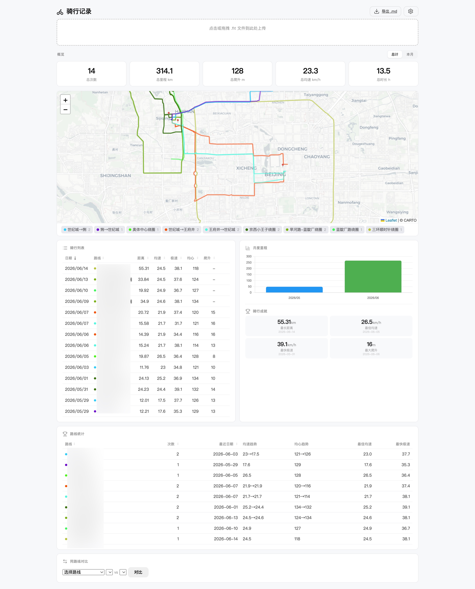
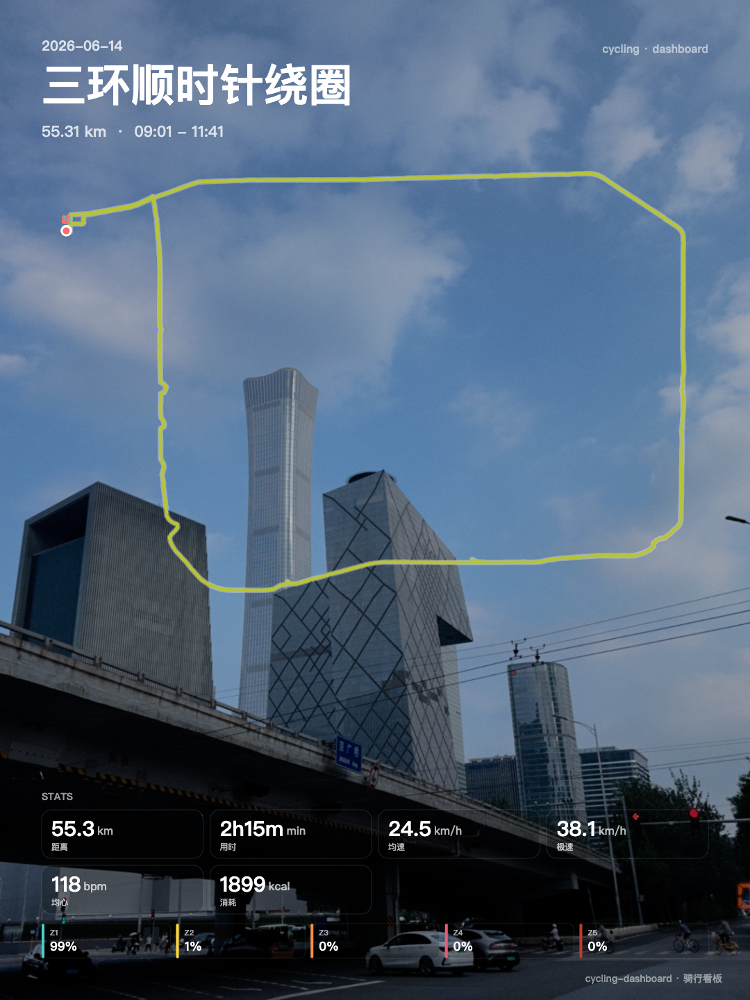

#  骑行记录看板

>  这是一个 **Vibe Coding** 作品——完全通过 AI 对话完成,零手工编码。

将 WorkoutDoors / Garmin 等 App 导出的 .fit 骑行文件拖拽到浏览器,自动解析并展示地图路线、骑行数据和分析统计。



##  功能一览

| 功能 | 说明 |
|------|------|
|  拖拽上传 | 拖入或点击选择 .fit 文件,秒级解析(浏览器端优先,Python 兜底) |
|  轨迹地图 | Leaflet 地图展示每次骑行的完整 GPS 路线 |
|  数据看板 | 心率 / 速度 / 海拔趋势图、月度里程柱状图 |
|  **智能路线命名** | 自动识别起点终点位置,三种命名模式自由选 |
|  地标辅助 | 自动从路线名提取地名作为地标,也支持手动标记 |
|  绕圈检测 | 起点终点相同时自动进入「绕圈命名」模式,显示途经点 |
|  路线统计 | 同路线对比、均速趋势、频次分析、排序筛选 |
|  动态颜色 | 路线越活跃越鲜艳,长期不骑自动变灰 |
|  **速度热力图** | top 5% 极速段用蓝色高亮,其余红→黄→绿渐变 |
|  **图片分享图** | 一键导出 1:1 / 3:4 分享图,5 预设渐变 + 纯色 + 自定义图片 |
|  **Strava 同步** | 解析后可选自动 / 手动上传到 Strava(需要自建 API App) |
|  骑行点评 | 每次骑行写感想,保存后自动持久化 |
|  编辑管理 | 重命名路线(同名批量改)、删除记录 |
|  导出 Markdown | 一键导出完整骑行报告,结构清晰,方便 AI 分析或归档 |
|  Obsidian 可选同步 | 配置导出路径后自动同步(不绑定 Obsidian,可放任意位置) |

##  快速开始

### macOS

```bash
# 双击 start.command 即可,或终端运行:
cd cycling-dashboard
pip3 install -r requirements.txt
python3 server.py
```

浏览器打开 **http://localhost:8080**

### Windows / Linux

```bash
pip install -r requirements.txt
python server.py
```

##  上传 .fit 文件

拖拽 .fit 文件到浏览器的上传区域,或点击上传区域选择文件。支持批量处理:

```bash
python scripts/process_fit.py ~/Downloads/*.fit
```

##  路线命名的三种模式

上传新路线自动检测匹配,未匹配时弹出命名弹窗:

| 模式 | 触发条件 | 示例 |
|:---|:---|:---|
| → 起终点 | 起点 ≠ 终点 | `A→B(途经)` |
|  绕圈 | 起点 ≈ 终点 | `X 绕圈` |
|  自定义 | 随时可用 | `自定义路线名` |

弹窗会显示 GPS 反编码的地点名和地标提示,输入后自动生成最终路线名。

##  Strava 同步(可选)

>  **重要:Strava 同步要求你自建一个 Strava API App**,每个用户用自己的 client_id / client_secret,不会上传到本仓库或共享给其他人。
>
> 之所以这样做,是因为 Strava 没有「统一代理」模式,任何要同步的账号都必须注册自己的 OAuth 应用(2 分钟搞定,免费的)。

### 接入步骤

1. 打开 https://www.strava.com/settings/api ,点 **Create App**
   - **App Name**: 随便填(如 `cycling-dashboard`)
   - **Website**: 随便填
   - **Authorization Callback Domain**: 填 `localhost` 三个字
2. 创建后会显示 **Client ID** 和 **Client Secret**(点 Show 露出来),复制
3. 回到本看板,点右上角  → 滚到底部「Strava 同步」区 → 粘贴 ID + Secret → 保存
4. 点「连接 Strava」,浏览器跳到 Strava 让你点 Authorize,完成授权后自动跳回
5. 之后上传 .fit 会在状态栏出现「同步到 Strava」按钮(或在设置里勾上「解析后自动同步」)

### 安全说明

- Client Secret / Token **仅保存在你本地的 `config.json`**(在 .gitignore 里,不会上传 GitHub)
- 同步走 `server.py` 的本地代理(`/strava/*`),浏览器 → 你的电脑 → Strava,不经第三方
- 不想用了点「断开」,清空本地所有 token

##  图片分享图

在骑行详情视图点右上角分享图标(),可生成并下载 PNG:

- **比例**: 1:1 (1080×1080) / 3:4 (1080×1440)
- **背景**: 5 个预设渐变(落日 / 深空 / 速度 / 清新 / 极简) / 纯色 / 自定义图片
- **统计项**: 10 项可勾选(距离、用时、均速、极速、均心、最高心、爬升、消耗、圈数、HR 分区)
- **水印**: 右下角小字「cycling-dashboard · 骑行看板」



##  配置导出路径(可选)

```bash
cp config.example.json config.json
```

编辑 `config.json`:

```json
{
  "obsidian": {
    "enabled": true,
    "vault_path": "~/Documents/骑行记录.md"
  }
}
```

> 不配置也不影响使用,可随时在页面右上角  或点  手动导出。

##  系统要求

- Python 3.8+
- 现代浏览器(Chrome / Edge / Safari)

```bash
pip install -r requirements.txt
```

##  .fit 文件兼容性

| App | 状态 |
|:---|:---:|
| WorkOutDoors (iOS) |  完整支持 |
| Garmin Connect |  标准 FIT 协议 |
| Wahoo Fitness |  同上 |
| Strava 导出 |  同上 |
| 其他标准 .fit 导出 |  未大量测试,欢迎反馈 Issue |

##  技术栈

| 层 | 技术 |
|:---|:---|
| 后端 | Python 3 + http.server |
| 前端 | 原生 JavaScript (ES Module) |
| 地图 | Leaflet.js + CARTO 底图 |
| 图表 | Chart.js |
| .fit 解析 | fit-file-parser (浏览器) / fitparse (Python 兜底) |
| 图片合成 | Canvas API |
| Strava | 本地 OAuth 代理 |
| 地理编码 | OpenStreetMap Nominatim API |

##  项目结构

```
cycling-dashboard/
├── server.py           # 本地服务器(双击或终端启动)
├── start.command       # macOS 一键启动
├── index.html          # 看板页面
├── css/style.css       # 样式
├── js/                 # 前端脚本
│   ├── app.js          # 主逻辑
│   ├── map.js          # Leaflet 地图
│   ├── charts.js       # Chart.js 趋势图
│   ├── locations.js    # 地标 + Nominatim
│   ├── storage.js      # rides.json 读写
│   ├── export.js       # 分享图 Canvas 合成
│   └── fit-parser-bundle.js  # 浏览器端 .fit 解析
├── data/               # 用户数据(不提交 GitHub)
├── scripts/            # 工具脚本
│   ├── parse_fit.py    # .fit 解析(Python)
│   ├── process_fit.py  # 批量处理
│   └── sync_obsidian.py# 同步到配置路径
└── __processed__/      # 已处理文件归档
```

##  更新日志

### v0.2.0(2026-06)

**新功能**
-  **图片分享图导出**:Canvas API 合成,1:1 / 3:4 双比例,5 预设渐变 + 纯色 + 自定义图片,10 项统计可勾选
-  **Strava 同步**:完整 OAuth 流程,本地代理,自动 token 刷新,支持自动 / 手动同步,首次使用向导
-  **速度热力图**:轨迹按速度染色,top 5% 极速段蓝色高亮
-  **顶部统计「总计/本月」切换**:5 张总览卡片(次数/里程/爬升/均速/时长)按 scope 切换,偏好 localStorage 持久化

**修复**
-  图片导出:HR 分区 chip 在选满统计项时溢出画布 → 改动态上移
-  地图:RIDES 与 allPolylines 索引错位(无轨迹的 ride 跳过 push 导致后续全偏) → 改占位 push + 按 `poly.ri` 匹配
-  地图:CORS 兜底(tile layer 加 `crossOrigin: 'anonymous'`)
-  Strava:断开连接时清掉前端缓存的过期 token
-  Strava:macOS python.org Python 缺 cert.pem 导致 SSL 验证失败 → certifi 兜底

**清理**
-  隐私脱敏:个人数据 / 截图 / TODO / CLAUDE.md / merge_fit.py 全部从 repo 移除
-  占位符替硬编码地名(原代码里残留的若干真实地点名)

### v0.1.0(2026-05)

-  首个 release:核心解析、地图、图表、地标、绕圈检测、路线对比、Obsidian 同步
-  速度热力图(后续版本号下)
-  Emoji → Lucide SVG 图标替换

##  许可

MIT
